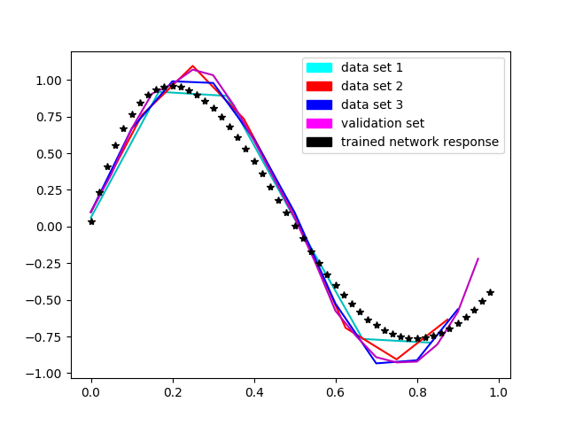
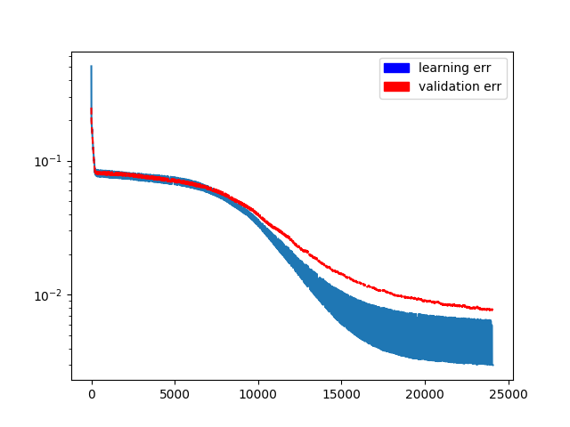
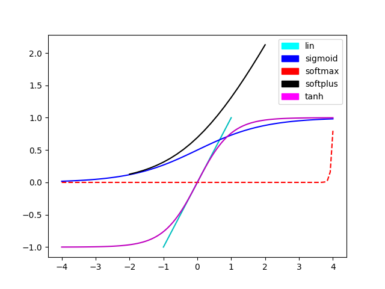

NaiveNeurals
============

Naive implementation of perceptron neural network. Under heavy development.


- [X] Implement 3 layer MLP network with SGD back-propagation algorithm
- [ ] Test coverage at least 80%
- [X] Allow model export/import to json
- [X] Prepare network learning examples and analysis for:
    - [X] Classification problem
    - [X] Regression problem
    - [X] Time series problem
- [ ] Use MLP network for MNIST dataset
- [ ] Implement various activation function
    - [X] Tanh
    - [X] Softmax
    - [X] Softplus
    - [ ] Gaussian
- [ ] Explore back-propagation algorithms:
    - [X] SGD with momentum
    - [ ] ADAM
    - [ ] Levenberg-Marquardt


Major inspiration for this work comes from book ``Machine Learning - An Algorithmic Perspective``.


Getting started
---------------

```bash
git clone https://github.com/stovorov/NaiveNeurals
cd NaiveNeurals
```


Prepare environment (using virtualenv)
--------------------------------------

Requires Python 3.6

```bash
source set_env.sh     # sets PYTHONPATH
make venv
source venv/bin/activate
make test
```

If you are using Ubuntu based system you must install tkinter

```bash
$ sudo apt-get install python3.6-tk
```

Usage
-----

```python
from NaiveNeurals.MLP.network import NeuralNetwork
from NaiveNeurals.data.dataset import DataSet

nn = NeuralNetwork()
input_data_size = 2
output_data_size = 1
hidden_layer_number_of_nodes = 5

# every list in inputs represents one input and data pushed into network
inputs =  [[0, 0, 1, 1], [1, 0, 1, 0]]
targets = [[1, 0, 0, 1]]

data_set = DataSet(inputs, targets)
nn.train(data_set)
```

### Example

In ``scripts/regression_problem.py`` you may find example of training network with sine-like data.

Achieved results:

Approximation:



Convergence:



Example of classification training can be found in ``scripts/classification_problem.py``

### Activation functions

For learning network, different activation functions can be used:




References
----------

[Machine Learning - An Algorithmic Perspective (2nd edition)](https://www.amazon.com/Machine-Learning-Algorithmic-Perspective-Recognition/dp/1466583282/ref=dp_ob_title_bk)

[Stephen's Marsland homepage](https://seat.massey.ac.nz/personal/s.r.marsland/mlbook.html)

[Mat's Mazur Blog](https://mattmazur.com/2015/03/17/a-step-by-step-backpropagation-example/)

[Python neural network pt.1](https://iamtrask.github.io/2015/07/12/basic-python-network/)

[Python neural network pt.1](https://iamtrask.github.io/2015/07/27/python-network-part2/)

[Activation function in neural networks](https://towardsdatascience.com/activation-functions-neural-networks-1cbd9f8d91d6)

[Gradient Descent with Momentum](http://www.cs.bham.ac.uk/~jxb/NN/l8.pdf)

[SoftMax explained](https://eli.thegreenplace.net/2016/the-softmax-function-and-its-derivative/)
